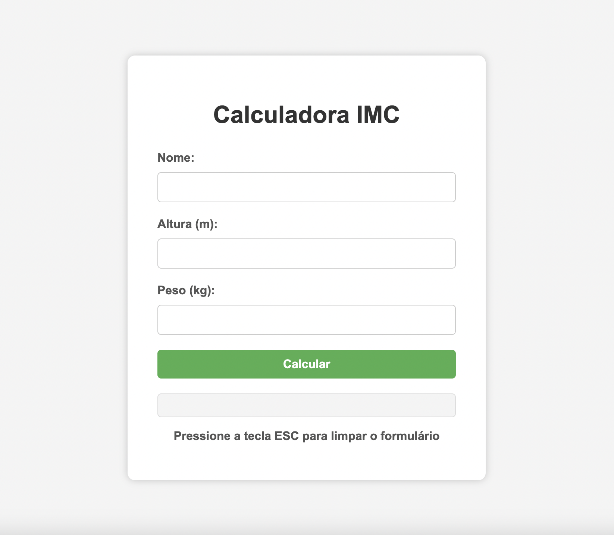

# Calculadora de IMC

Uma calculadora de IMC (Índice de Massa Corporal) desenvolvida com HTML, CSS e JavaScript, que permite calcular e classificar o IMC de um indivíduo com base em seu peso e altura. O projeto inclui recursos de usabilidade, como envio com a tecla **Enter** e recarregamento com a tecla **Esc**.

## Demonstração



---

## 📋 Funcionalidades

- Entrada de dados de nome, altura e peso.
- Exibição do IMC calculado e sua categoria:
  - **Abaixo do peso**
  - **Peso normal**
  - **Sobrepeso**
  - **Obesidade**
- Alteração de cores no resultado para facilitar a visualização da categoria.
- Funcionalidade de envio com tecla **Enter**.
- Recarregamento da página com a tecla **Esc**.

---

## 🛠️ Tecnologias Utilizadas

- **HTML5**: Estrutura semântica do projeto.
- **CSS3**: Estilização responsiva e moderna.
- **JavaScript**: Lógica de validação, cálculo e interatividade.

---

## 🎨 Layout

O design é limpo e responsivo, com uma interface amigável para facilitar a experiência do usuário.

### Exemplo:

```html
<div id="imc-form">
  <h1>Calculadora IMC</h1>
  <form id="calc-form">
    <label for="nome">Nome:</label>
    <input type="text" id="nome" />
  </form>
</div>
```

---

## 🚀 Como executar o projeto

### Pré-requisitos

- Navegador web atualizado

### Passos

1. Clone o repositório:
   ```bash
   git clone https://github.com/bdancost/form_validation.git
   ```
2. Navegue até o diretório do projeto:
   ```bash
   cd calculadora-imc
   ```
3. Abra o arquivo `index.html` em seu navegador.

---

## 🔧 Estrutura de Arquivos

```
calculadora-imc/
├── index.html
├── styles.css
├── script.js
```

---

## 💡 Melhorias Futuras

- [ ] Adicionar suporte para múltiplos idiomas.
- [ ] Implementar gráficos para mostrar a evolução do IMC.
- [ ] Criar uma API para persistir os dados dos usuários.

---
